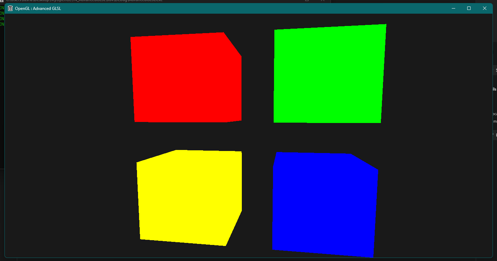
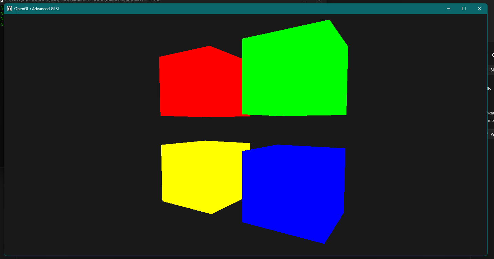

# OpenGL-AdvancedGLSL

## Description

Experiments and implementations of advanced GLSL rendering techniques in C++, including custom shaders and effects.

## Screenshots


*Example screenshot showcasing the project.*


*Another example screenshot showcasing advanced rendering effect.*

## Dependencies

This project relies on the following libraries and dependencies:

*   **OpenGL32.lib:** The standard OpenGL library for Windows. This dependency is typically included with your Windows SDK or graphics driver installation.

    *   **Note:** You might need to link against `opengl32.lib` in your project settings.

*   **GLM (OpenGL Mathematics):** A header-only C++ mathematics library for graphics software. This project uses GLM for vector and matrix operations in shader code.

    *   **Download:** [https://github.com/g-truc/glm](https://github.com/g-truc/glm)
    *   **Installation:** To use GLM, simply copy the `glm` directory into your project's include path. No separate building or linking is required.
*   **GLEW (OpenGL Extension Wrangler Library):** A cross-platform C/C++ extension loading library. GLEW is used to dynamically query and load OpenGL extensions and functions, enabling the use of newer OpenGL features.

    *   **Download:** [https://github.com/nigels-com/glew](https://github.com/nigels-com/glew)
    *   **Installation:**
        1.  Download the GLEW source code and extract the contents to a directory on your system.
        2.  Build GLEW using Visual Studio 2022 or CMake. Follow the instructions in the GLEW documentation for building.
        3.  Copy the GLEW header files to your project's include path.
        4.  Link against the GLEW library (`glew32.lib` for Windows) in your project settings.

## Build Instructions (Visual Studio 2022)

1.  **Clone the repository:** Clone this repository to your local machine.
    ```
    git clone [your repository URL]
    ```

2.  **Open the Visual Studio Project:** Open the `OGLvcvproj` file in Visual Studio 2022.

3.  **Configure Include Directories:**
    *   In Solution Explorer, right-click on your project and select **Properties**.
    *   Navigate to **C/C++** -> **General** -> **Additional Include Directories**.
    *   Add the following paths:
        *   Path to your GLEW include directory (e.g., `C:\glew\include`)
        *   Path to your GLM include directory (e.g., `C:\glm`)

4.  **Configure Library Directories:**
    *   Navigate to **Linker** -> **General** -> **Additional Library Directories**.
    *   Add the path to your GLEW library directory (e.g., `C:\glew\lib\Release\Win32` or `C:\glew\lib\Release\x64`, depending on your build architecture).

5.  **Configure Linker Input:**
    *   Navigate to **Linker** -> **Input** -> **Additional Dependencies**.
    *   Add the following libraries:
        *   `opengl32.lib`
        *   `glew32.lib` (or `glew32s.lib` for the static version)

6.  **Build the Project:** Press `Ctrl+Shift+B` to build the project.

## Usage

1.  **Run the Executable:** After building, run the executable located in the `x64/Debug` or `x64/Release` directory.
2.  **Explore Techniques:** The application demonstrates various advanced OpenGL techniques.  [Provide specific examples, e.g., "Press '1' to enable SSAO, '2' to toggle bloom"].
3.  **Experiment:**  Modify the shader code in the `shaders` directory to experiment with different rendering effects.

---

**NOTE:**

*   **Image Paths:** DOUBLE-CHECK the paths for `screenshot1.png` and `screenshot2.png`.  If they are *not* in the same directory as the `README.md` file, you'll need to adjust the paths accordingly (e.g., `./images/screenshot1.png` if they're in an `images` subdirectory).
*   **GLEW Static vs. Dynamic:** If you're using the static GLEW library, use `glew32s.lib` and define `GLEW_STATIC` in your preprocessor definitions (C/C++ -> Preprocessor -> Preprocessor Definitions in Visual Studio).
*   **Platform/Architecture:** Adjust the library paths (e.g., `Win32` vs. `x64`) based on your target platform and build architecture in Visual Studio.
*   **Error Handling:** Add error handling (e.g., checking if GLEW initialization succeeded) to make your application more robust.
